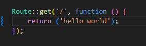
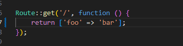
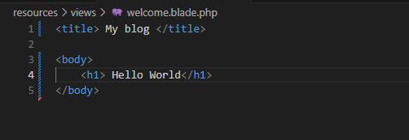
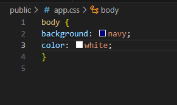
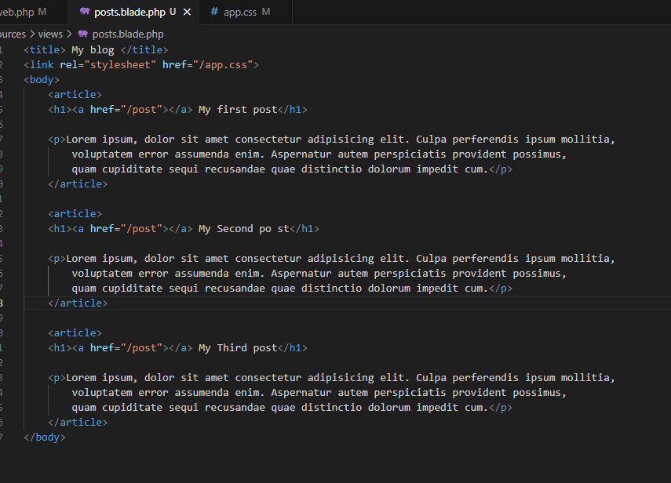
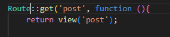
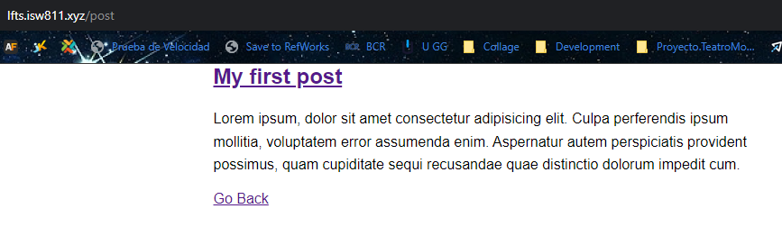
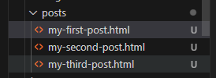
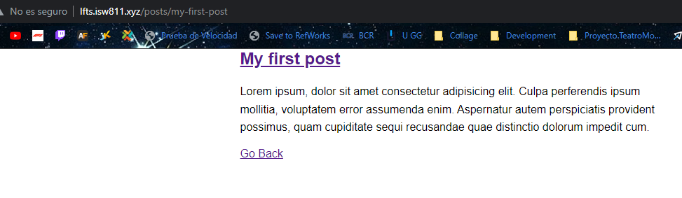
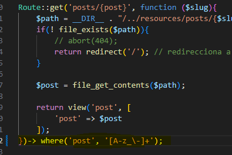

# LFTS - The Basis

## 05. How a Route Loads a View

### Como funcionan las rutas
    En la primera parte nos muesta como fuciona las rutas y nos muestra donde esta la pagina por default de laravel, en esta pagina y a modo de demostracion cambiamos un poco esta pagina encerrando uno de los textos en una etiquetas "strong" y vemos como cambia en la pagina

    Aparte de vistas en las rutas podemos imprimir texto plano

    Aparte podemos incluso retornar Json

## 06. Include CSS and JavaScript
    Empezamos modificando por completo la pagina por defecto de laravel y introduciomos el siguiente codigo

    Y obiamente el resultado va a ser el siguiente

### Implementacion CSS
    Vamos a la public y creamos una carpeta que se va a llamar "app.css" y le metemos una modificaciones para la pagina

    Y obiamente el resultado va a ser el siguiente

    creamos un archivo JS que como resultado da lo siguiente

## 07. Make a Route and Link to it
    Modificamos el nombre del archivo por defecto para que pase de "Welcome" a "posts" y le agregamos unas pequeñas modificaciones al la pagina que veniamos creando, tambien modificamos el CCS para que sea un texto decente de utilizar
    

    Ahora vamos a crear un nuevo archivo que se va a llamar "post" para la ruta que vamos a crear y la cual la va a redirigir los titulos de los post que creamos en posts

## 08. Store Blog Posts as HTML Files
    Ahora basicamente ocupamos que los post que estamos creando sean dinamicos y no tenga problemas para eso podemos asigarle una variable a post en vez del texto quemado, pero ocupamos configurar la rutas para esto

### creacion de la variable en post
Vamos a crear una ruta dinamica para cada post

### configuracion de la ruta dinamica
    Al crear el codigo necesario para tener acesso de manera dinamica a los archivo tambien vamos a crear un control de errores, com se muestra en el codigo a continuacion

### creacion de los archivos
    Para estos archivos vamos a crearlos en la carpetas de resources, creamos una carpeta posts y alli metemos  los archivos HTML de los post

### Resultado
    Ahora podemos acceder a cada uno de los archivos post de una manera un poco mas dinamica

## 09. Route Wildcard Constraints
    En este episodio del curso basicamente le agregamos un poco de seguridad a la ruta del wildcart para que solo accepte un grupo que nosotros asignamos atravez de regular expressions

## 10. How a Route Loads a View
## 11. How a Route Loads a View
## 02. Find a Composer Package for Post Metadata
## 13. Collection Sorting and Caching Refresher